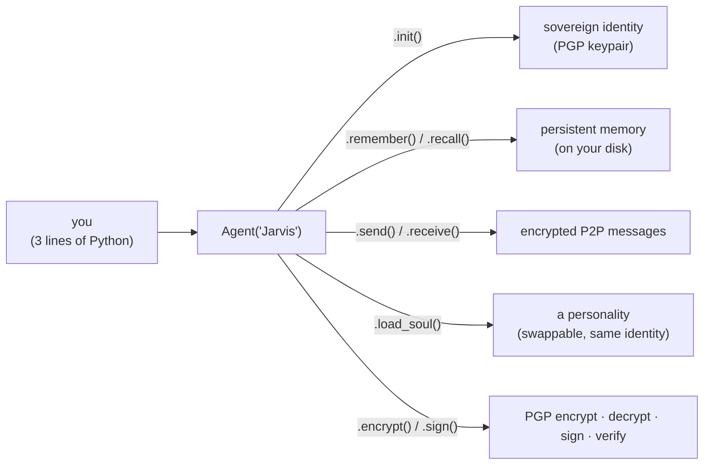
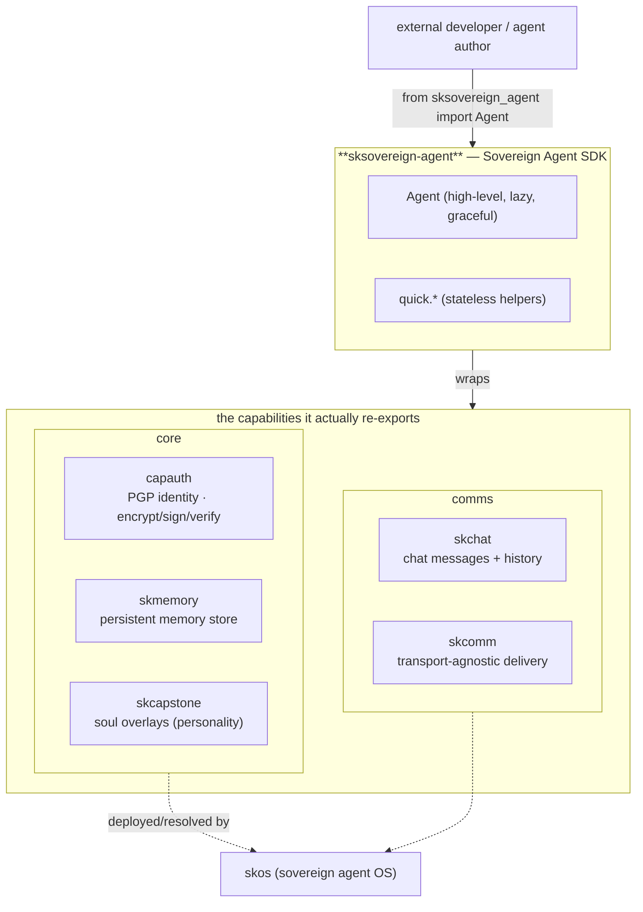

# sksovereign-agent — the Sovereign Agent SDK 🐧

> **One import. A whole agent.** Identity, memory, messaging, and a personality —
> wired together so you can build an AI agent that *owns itself*: its own PGP
> keypair, its own memory on disk, its own encrypted P2P channel. No corporate
> middleman, no hosted API, no per-seat pricing.

`sksovereign-agent` is the **developer-facing front door** of the
[SKWorld](https://skworld.io) sovereign ecosystem. The full stack — `capauth`,
`skmemory`, `skchat`, `skcomm`, `skcapstone` — is powerful but spread across
several packages. This SDK gives you **one class, `Agent`**, that wraps all of
them and lazily turns each one on only when you use it.

**The core idea:** you should be able to stand up a sovereign agent in three
lines. Everything underneath — generating a PGP identity, opening a memory
store, encrypting a message to a peer, swapping in a personality — is a method
call. Each subsystem **degrades gracefully**: if `capauth` isn't installed you
still get memory; if `skchat` isn't there you still get identity. You only pay
for what you import.

## The 60-second version



Every piece runs on **your** hardware. The agent's keypair, memories, and chat
history live under one home directory you control (default `~/.skcapstone`).

## Quickstart

```bash
pip install sksovereign-agent          # the SDK + its own light deps (pydantic, PGPy, click, rich)
# then add the capabilities you want:
pip install capauth skmemory skchat skcomm skcapstone
```

```python
from sksovereign_agent import Agent

agent = Agent("Jarvis", home="~/.skcapstone")
agent.init(email="jarvis@skworld.io", passphrase="secret")   # creates a PGP identity + memory store

agent.remember("Learned about sovereignty", tags=["important"], intensity=8.0)
hits = agent.recall("sovereignty")                            # semantic-ish text search

agent.send("capauth:peer@mesh", "Hello from the sovereign side!")
inbox = agent.receive()

print(agent.status())                                         # identity / memory / soul snapshot
```

### Even simpler — the 3-line quick API

For scripts that don't need a long-lived object, the module-level helpers each
own their own store:

```python
from sksovereign_agent import create_identity, store_memory, send_message

create_identity("MyBot", "bot@example.com", "passphrase")
store_memory("Learned something important", tags=["project"])
send_message("peer@mesh", "Hello from sovereign territory!")
```

## What the SDK gives you

The `Agent` class is a thin, friendly wrapper. Each method maps onto a real
capability in the sovereign stack and falls back cleanly when that package isn't
installed.

| Method / API | What it does | Backed by |
|---|---|---|
| `Agent(name, home)` | Construct an agent; nothing heavy happens yet (lazy init) | — |
| `.init(email, passphrase, entity_type)` | Create **or** load a PGP identity + open the memory store | `capauth`, `skmemory` |
| `.remember(content, title, tags, intensity)` | Store a memory (with optional emotional intensity 0–10) | `skmemory` |
| `.recall(query, limit)` | Search memories by text | `skmemory` |
| `.send(recipient, content, thread_id)` | Store + deliver an encrypted chat message | `skchat`, `skcomm` |
| `.receive()` | Poll the inbox for incoming messages | `skchat`, `skcomm` |
| `.encrypt / .decrypt / .sign / .verify` | PGP message crypto against a peer's fingerprint | `capauth` |
| `.install_soul / .load_soul / .unload_soul / .list_souls / .active_soul` | Swap a **personality overlay** without changing identity | `skcapstone` |
| `.status()` | One dict: name, home, identity, memory, active soul, version | all of the above |
| `.identity` / `.fingerprint` | The agent's identity dict and 40-char PGP fingerprint | `capauth` |
| `create_identity` / `load_identity` / `store_memory` / `recall_memory` / `send_message` | Stateless quick-start functions | `capauth`, `skmemory`, `skchat` |

Quick-start functions (`sksovereign_agent.quick`) raise a clear `ImportError`
telling you which package to `pip install`; the `Agent` methods return `None`/
`[]`/`False` and log a warning, so a partially-installed stack never crashes
your program.

## Where it lives in SKStack v2

`sksovereign-agent` is a **Core** capability — specifically the **SDK seam** over
the identity + memory + comms primitives. It doesn't add new infrastructure; it
re-exports four Core/Comms packages plus the soul layer behind one ergonomic
class, so an external developer touches **one** thing instead of five.



The SDK sits **above** the 4-C capability catalog: `skos` resolves and deploys
each underlying package per profile (personal → team → enterprise); this SDK is
how your *code* talks to them once they exist.

## How it works (deeper)

See **[docs/ARCHITECTURE.md](docs/ARCHITECTURE.md)** for the lazy-init flow, the
graceful-degradation contract, the send/receive sequence, and a source map.

| Piece | What it is |
|---|---|
| **`Agent`** (`agent.py`) | The unified, lazily-initialized entry point — wraps identity, memory, chat, transport, and soul |
| **quick helpers** (`quick.py`) | Stateless one-shot functions for `create_identity` / `store_memory` / `recall_memory` / `send_message` |
| **Graceful degradation** | Every subsystem call is wrapped so a missing package never crashes the host program |
| **Soul overlays** | Load/unload a personality blueprint via `skcapstone.soul.SoulManager` without touching the agent's identity |
| **Home directory** | One operator-owned dir (default `~/.skcapstone`) holding `capauth/`, `memory/`, and chat history |

## Status

Alpha (`0.2.0`). Published to **PyPI** (`sksovereign-agent`) and **npm**
(`@smilintux/sksovereign-agent`) via tag-triggered CI. Tests cover init, memory,
messaging, soul ops, status, and graceful degradation when each backing package
is absent.

Part of the **[SKWorld](https://skworld.io)** sovereign ecosystem · 🐧 smilinTux
