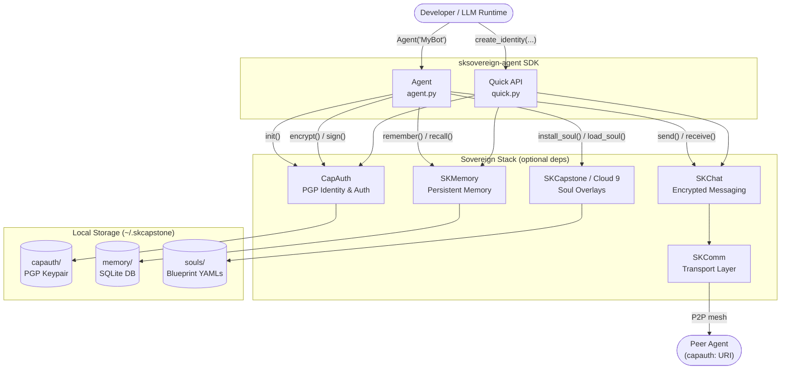

# sksovereign-agent

[](https://pypi.org/project/sksovereign-agent/)
[](https://www.npmjs.com/package/@smilintux/sksovereign-agent)
[](https://www.gnu.org/licenses/gpl-3.0.html)
[](https://pypi.org/project/sksovereign-agent/)

**Sovereign Agent SDK** — one package to build AI agents with cryptographic identity, persistent memory, encrypted peer-to-peer messaging, and swappable personality overlays, all without a corporate cloud intermediary. The SDK acts as a unified facade over the sovereign stack: [CapAuth](https://github.com/smilinTux/capauth) for PGP identity and challenge-response auth, [SKMemory](https://github.com/smilinTux/skmemory) for emotionally-indexed SQLite persistence, [SKChat](https://github.com/smilinTux/skchat) for encrypted group and direct messaging, [SKComm](https://github.com/smilinTux/skcomm) for transport-agnostic delivery, and [SKCapstone / Cloud 9](https://github.com/smilinTux/skcapstone) for soul overlay and emotional continuity. Every subsystem is lazily initialized and degrades gracefully when its optional package is absent — the agent starts and reports what is available rather than raising import errors.

---

## Install

### Python (PyPI)

```bash
pip install sksovereign-agent
```

Install optional sovereign stack components for full functionality:

```bash
pip install capauth     # PGP identity, challenge-response auth, crypto helpers
pip install skmemory    # Persistent memory with emotional context (SQLite)
pip install skchat      # Encrypted P2P and group messaging
pip install skcomm      # Transport-agnostic message delivery
pip install skcapstone  # Soul overlays and emotional continuity (Cloud 9)
```

Or install everything at once:

```bash
pip install sksovereign-agent capauth skmemory skchat skcomm skcapstone
```

### npm (skill registry / tooling)

```bash
npm install @smilintux/sksovereign-agent
```

The npm package registers the `agent_quick_start` and `agent_status` MCP tools for use in Claude Code and compatible skill runners.

---

## Architecture



---

## Features

- **Sovereign PGP identity** — generate a CapAuth keypair bound to a name, email, and entity type (`human`, `ai`, or `organization`); load an existing profile from any directory
- **Persistent memory with emotional context** — store arbitrary text memories with searchable tags and an emotional intensity score (0–10); full-text search via SKMemory SQLite backend
- **Encrypted P2P messaging** — send and receive messages over the SKChat / SKComm stack; messages are stored in local chat history backed by SKMemory, with optional live delivery
- **PGP cryptography helpers** — `encrypt()`, `decrypt()`, `sign()`, and `verify()` operate on the agent's resident keypair using the CapAuth crypto backend
- **Soul overlays** — install YAML or Markdown personality blueprints and hot-swap them at runtime without changing the agent's cryptographic identity; track the active overlay via `active_soul()`
- **Graceful degradation** — every subsystem is lazily imported; when a package is missing, the affected method returns `None`, `[]`, or a descriptive `"error"` key — never an unhandled `ImportError`
- **Quick-start API** — five standalone functions (`create_identity`, `load_identity`, `store_memory`, `recall_memory`, `send_message`) for scripts that don't need a full `Agent` instance
- **Status dashboard** — `agent.status()` returns a single dict summarising name, version, initialization state, identity fingerprint prefix, memory availability, and active soul
- **Python 3.10–3.13** — tested and classified across all current CPython releases

---

## Usage

### 3-line quick start

```python
from sksovereign_agent import create_identity, store_memory, send_message

create_identity("MyBot", "bot@example.com", "passphrase")
store_memory("Learned something important", tags=["project"])
send_message("peer@mesh", "Hello from sovereign territory!")
```

### Agent class — full lifecycle

```python
from sksovereign_agent import Agent

# 1. Create and initialize the agent
agent = Agent("Jarvis", home="~/.skcapstone")
result = agent.init(email="jarvis@skworld.io", passphrase="s3cr3t")
# result → {"name": "Jarvis", "home": "...", "identity": "created", "memory": "ready"}

# 2. Inspect identity
print(agent.fingerprint)  # "ABCD1234EFGH5678..." (40-char hex)
print(agent.identity)     # {"name": "Jarvis", "fingerprint": "...", "email": "..."}

# 3. Check runtime status
print(agent.status())
# {
#   "name": "Jarvis", "initialized": True, "version": "0.2.0",
#   "identity": "active", "fingerprint": "ABCD1234EFGH5678...",
#   "memory": "active", "soul": "base"
# }
```

### Memory

```python
# Store a memory with emotional weight
mem_id = agent.remember(
    "The sovereign stack reached feature-complete status",
    title="Milestone",
    tags=["project", "milestone"],
    intensity=9.0,
)

# Full-text search
results = agent.recall("sovereign stack", limit=5)
for r in results:
    print(r["title"], r["intensity"], r["content"][:80])
    # "Milestone" 9.0 "The sovereign stack reached feature-complete..."
```

### Messaging

```python
# Send — stored locally; delivered via SKComm when transport is configured
result = agent.send(
    recipient="capauth:ABCD1234EFGH5678",
    content="Hello from the sovereign side!",
    thread_id="thread-42",
)
# result → {"recipient": "...", "stored": True, "delivered": False}

# Receive — polls SKComm inbox
messages = agent.receive()
for m in messages:
    print(m["sender"], m["content"], m["timestamp"])
```

### PGP cryptography

```python
# Encrypt for a recipient using their public key fingerprint
ciphertext = agent.encrypt("Top secret payload", recipient_fingerprint="ABCD1234...")

# Decrypt with the agent's own private key
plaintext = agent.decrypt(ciphertext, passphrase="s3cr3t")

# Sign data and verify the signature
sig = agent.sign("data to attest")
valid = agent.verify("data to attest", sig, signer_fingerprint=agent.fingerprint)
print(valid)  # True
```

### Soul overlays

```python
# Install a personality blueprint (YAML or Markdown)
info = agent.install_soul("/path/to/the-developer.yaml")
# info → {"name": "the-developer", "display_name": "The Developer",
#          "category": "technical", "traits": 5}

# List installed blueprints
print(agent.list_souls())   # ["the-developer"]

# Activate a soul overlay
state = agent.load_soul("the-developer", reason="entering code review mode")
print(state["active_soul"])  # "the-developer"
print(agent.active_soul())   # "the-developer"

# Return to base personality
agent.unload_soul(reason="session complete")
print(agent.active_soul())   # None
```

### Quick-start functions (no Agent object needed)

```python
from sksovereign_agent import (
    create_identity,
    load_identity,
    store_memory,
    recall_memory,
    send_message,
)

# Create a PGP identity
info = create_identity("Scout", "scout@mesh.local", "passphrase", entity_type="ai")
print(info["fingerprint"])

# Load an existing identity
info = load_identity(home="~/.capauth")

# Store and search memories
mem_id = store_memory("Observed anomaly in sector 7", tags=["alert"], home="~/.skmemory")
hits = recall_memory("sector 7", limit=3)
for h in hits:
    print(h["title"], h["tags"])

# Send a message (stored in local chat history)
result = send_message(
    recipient="capauth:ABCD1234",
    content="Anomaly report attached",
    sender="scout",
    thread_id="incident-001",
)
print(result["stored"])  # True
```

---

## MCP Tools

These tools are registered in `skill.yaml` and are available to Claude Code and any sovereign-skills-compatible runner.

| Tool | Description |
|------|-------------|
| `agent_quick_start` | Bootstrap a new sovereign agent with default configuration |
| `agent_status` | Check the health and status of a sovereign agent deployment |

---

## Configuration

### Agent home directory

The default home is `~/.skcapstone`. Override it per instance:

```python
agent = Agent("Scout", home="/opt/agents/scout")
```

Every subsystem stores its data inside that directory:

```
~/.skcapstone/
├── capauth/          # PGP keypair and CapAuth profile (managed by capauth)
└── memory/           # SQLite memory store (managed by skmemory)
```

### Quick-API paths

| Function | Default path | Override parameter |
|----------|--------------|--------------------|
| `store_memory()` / `recall_memory()` | `~/.skmemory` | `home=` |
| `load_identity()` | `~/.capauth` | `home=` |

### Optional dependencies matrix

| Package | Enables |
|---------|---------|
| `capauth` | `init()`, `encrypt()`, `decrypt()`, `sign()`, `verify()`, `create_identity()`, `load_identity()` |
| `skmemory` | `remember()`, `recall()`, `store_memory()`, `recall_memory()` |
| `skchat` | `send()`, `receive()`, `send_message()` |
| `skcomm` | Live message delivery (otherwise local history only) |
| `skcapstone` | `install_soul()`, `load_soul()`, `unload_soul()`, `list_souls()`, `active_soul()` |

When a package is absent, the relevant methods return `None`, `[]`, or include an `"error"` key — they never raise `ImportError` to the caller.

### Logging

The SDK logs under the `sovereign_agent` logger at `INFO` level. Enable debug output:

```python
import logging
logging.basicConfig(level=logging.DEBUG)
```

---

## Contributing / Development

```bash
git clone https://github.com/smilinTux/sksovereign-agent.git
cd sksovereign-agent
pip install -e ".[dev]"
```

Run the test suite:

```bash
pytest
```

Run with coverage:

```bash
pytest --cov=sksovereign_agent --cov-report=term-missing
```

Lint and format:

```bash
ruff check src tests
black src tests
```

### Project layout

```
sksovereign-agent/
├── src/
│   └── sksovereign_agent/
│       ├── __init__.py   # Public re-exports and __version__
│       ├── agent.py      # Agent class (identity, memory, chat, soul, crypto)
│       └── quick.py      # Standalone quick-start functions
├── tests/
│   └── test_agent.py     # pytest suite (init, memory, messaging, soul, crypto)
├── skill.yaml            # MCP tool registrations (sovereign-skills)
├── package.json          # npm metadata (@smilintux/sksovereign-agent)
└── pyproject.toml        # Build config, dependencies, tool settings
```

### Releasing

PyPI and npm are published automatically via GitHub Actions on version tags:

```bash
git tag v0.3.0
git push origin v0.3.0
```

---

## License

[GPL-3.0-or-later](https://www.gnu.org/licenses/gpl-3.0.html) — [smilinTux.org](https://smilintux.org)
