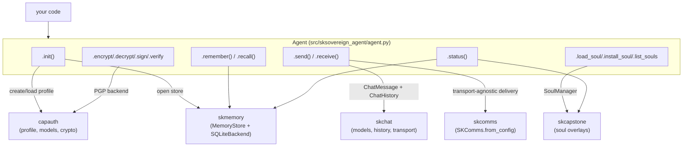
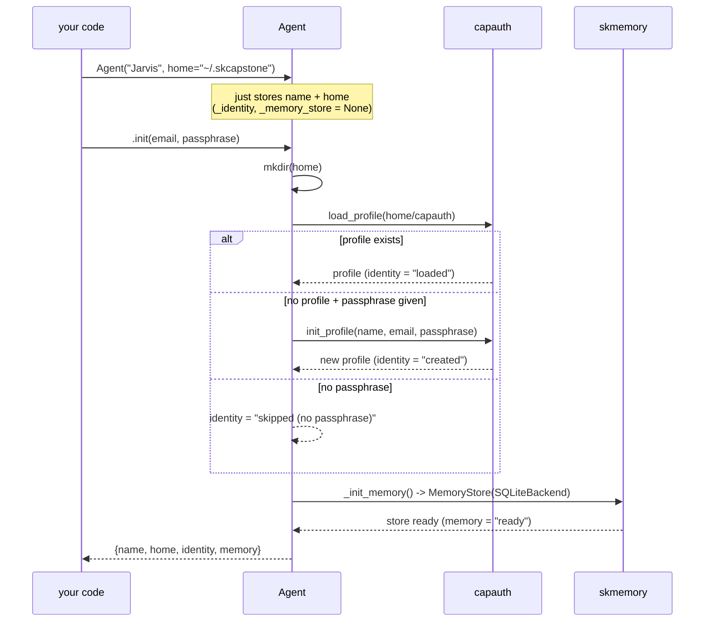
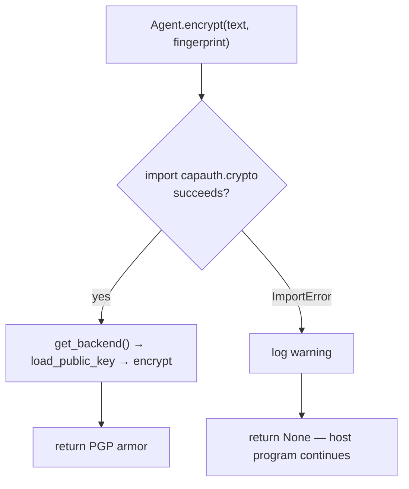
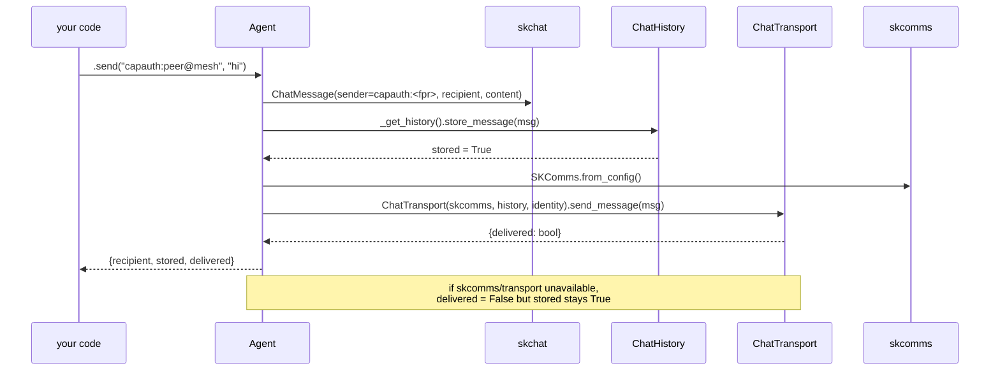
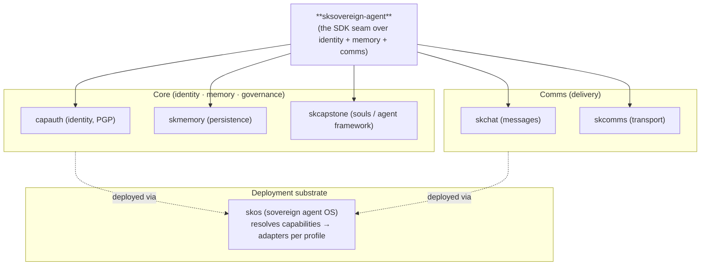

# Architecture — sksovereign-agent

`sksovereign-agent` is a **facade SDK**. It contains almost no infrastructure of
its own: its job is to present the five-package sovereign stack (`capauth`,
`skmemory`, `skchat`, `skcomms`, `skcapstone`) as a single, friendly `Agent`
object — and to make every one of those packages **optional at runtime**.

This document explains the two design contracts that make that work — **lazy
initialization** and **graceful degradation** — walks the key flows as mermaid
diagrams, maps the source, and shows where the SDK sits in the wider ecosystem.

---

## The shape: one class over five packages

Each arrow is a **deferred import inside the method body** — never a top-level
`import`. That is the whole trick: the SDK can be installed with only its light
dependencies (pydantic, PGPy, pyyaml, click, rich) and still import cleanly even
if none of the five capability packages are present.

---

## Contract 1 — lazy initialization

The `Agent` constructor does essentially nothing: it records `name` and `home`
and sets every subsystem handle to `None`. Real work happens on first use.

Subsystems beyond identity/memory (chat history, soul manager) are created on
**first call** via the private `_get_*` helpers (`_get_memory`, `_get_history`,
`_get_soul_manager`), each of which memoizes its handle and returns `None` if the
backing package can't be imported.

---

## Contract 2 — graceful degradation

The same operation behaves differently in the two public APIs, by design:

| Layer | When a backing package is missing | Why |
|---|---|---|
| **`Agent` methods** | return `None` / `[]` / `False`, log a warning, keep running | a long-lived agent should never crash because one optional capability is absent |
| **`quick.*` functions** | raise `ImportError("X is required: pip install X")` | one-shot scripts want a loud, actionable failure |

This is why `status()` can report `identity: none`, `memory: unavailable`, and
`soul: base` all at once without ever throwing: it asks each subsystem and
records whatever it gets back.

---

## Key flow — send a message

`send()` is the most layered method: it touches identity (for the sender URI),
chat (for the message + local history), and comm (for delivery), and it stays
useful even when only some of those are installed.

`receive()` mirrors this: it builds the same `ChatTransport` and calls
`poll_inbox()`, returning a list of plain dicts (sender, content, thread_id,
timestamp) — or an empty list if the comm/chat layer isn't present.

The sender identity is `capauth:<fingerprint>` when an identity exists, falling
back to `capauth:<name>` otherwise, so messages are always attributable.

---

## Source / content map

| Path | Role |
|---|---|
| `src/sksovereign_agent/__init__.py` | Package surface — re-exports `Agent` + the five quick functions; sets `__version__ = 0.2.0` |
| `src/sksovereign_agent/agent.py` | The `Agent` class: init, memory (`remember`/`recall`), messaging (`send`/`receive`), soul ops, crypto (`encrypt`/`decrypt`/`sign`/`verify`), `status`, and the private `_init_memory` / `_get_*` lazy helpers |
| `src/sksovereign_agent/quick.py` | Stateless helpers — `create_identity`, `load_identity`, `store_memory`, `recall_memory`, `send_message` (each opens its own store; raises `ImportError` on missing deps) |
| `tests/test_agent.py` | Pytest suite — init, memory, messaging, soul overlays, status, properties, and crypto graceful-degradation (`patch.dict(sys.modules, {...: None})`) |
| `pyproject.toml` | Python packaging (`src/` layout), light deps, PyPI metadata, GPL-3.0-or-later |
| `package.json` | npm publish metadata for `@smilintux/sksovereign-agent` |
| `skill.yaml` | SKWorld skill descriptor (`category: core`) exposing quick-start + status as tools |
| `.github/workflows/ci.yml` | CI: `pip install -e ".[dev]"` + `pytest` on Python 3.11/3.12/3.13 |
| `.github/workflows/publish.yml` | Tag-triggered (`v*`) publish to PyPI and npm |

---

## Backing packages (what each one provides)

| Package | C-tier | What the SDK uses from it |
|---|---|---|
| **capauth** | core | `profile.init_profile/load_profile`, `models.EntityType`, `crypto.get_backend` (encrypt/decrypt/sign/verify, key loading) |
| **skmemory** | core | `MemoryStore`, `SQLiteBackend`, `models.EmotionalSnapshot`; `snapshot()`, `search()`, `list_memories()` |
| **skcapstone** | core | `soul.SoulManager` — install / load / unload / list personality overlays |
| **skchat** | comms | `models.ChatMessage`, `history.ChatHistory`, `transport.ChatTransport` |
| **skcomms** | comms | `SKComms.from_config()` — transport-agnostic message delivery |

---

## Where it lives in the ecosystem

`skos` is responsible for *getting these packages onto a machine* and resolving
each capability port to a concrete adapter for the active profile. This SDK is
the layer **on top**: once those capabilities exist, `sksovereign-agent` is how
your application code drives them through a single object.

Part of the **[SKWorld](https://skworld.io)** sovereign ecosystem · 🐧 smilinTux
